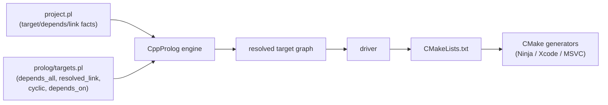
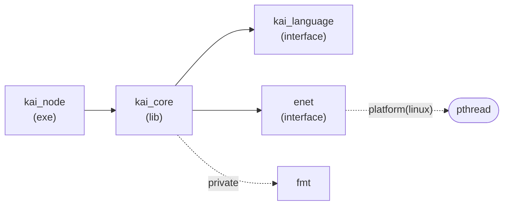
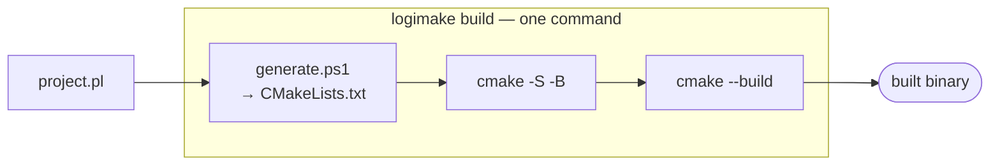
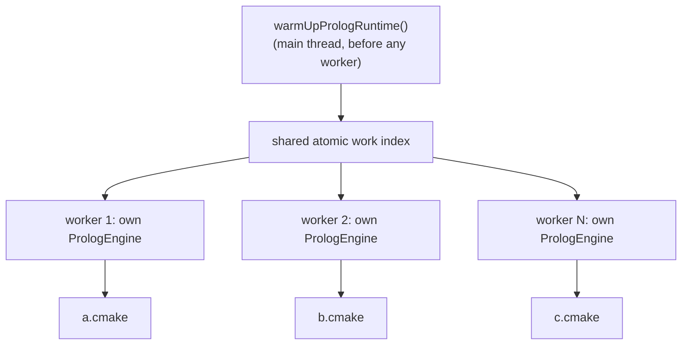

#  CppLogicMake

Prolog-resolved C++ build graphs, transpiled to CMake.

CppLogicMake replaces CMake's authoring layer — not its generator
backends. You describe targets and dependencies as Prolog facts.
[CppProlog](https://github.com/cschladetsch/CppProlog), checked out
as the `Ext/CppProlog` submodule and built as a library target,
resolves the graph (transitive dependencies, conditional links,
cycle detection). A driver emits a `CMakeLists.txt`. CMake still
does what it has always done well: generating Ninja, Xcode, and
MSVC projects from that file.

## Why this exists

CMake's underlying model — a DAG of targets with public/private
dependency propagation — is a reasonable design. The syntax that
expresses it is not: stringly-typed booleans, quoting rules that
change depending on context, `PUBLIC`/`PRIVATE`/`INTERFACE` as
positional string arguments instead of real visibility modifiers,
and generator expressions (`$<CONFIG:Debug>`) invented because the
host language couldn't express a conditional cleanly.

None of that needs to survive in the authoring layer. It only exists
because CMakeLists.txt files are handwritten in a general-purpose
imperative scripting language that predates the target-based model it
now tries to support. A build description is not a script. It's a
graph. CppLogicMake treats it as one.

The semantic boundary is documented in
[docs/semantic-surface.md](docs/semantic-surface.md): declarative
graph rules on one side, boring CMake emission on the other.

The name is a deliberate callback: C++ started life as "C with
Classes," a thin, mechanical layer over C, compiled down by Cfront
rather than reimplemented from scratch. CppLogicMake takes the same
approach to CMake — keep the substrate (its generator backends),
replace only the authoring syntax, and keep the transpile step small
and mechanical rather than clever.

## Why Prolog specifically

A build graph is naturally relational, and most of the operations
you actually want are exactly what a logic engine is built for:

- **Transitive dependency resolution** is two clauses, not a
  hand-rolled graph traversal:

  ```prolog
  depends_all(T, D) :- depends(T, D).
  depends_all(T, D) :- depends(T, X), depends_all(X, D).
  ```

- **Conditional linking and defines** are guards, not a bolted-on
  generator-expression mini-language:

  ```prolog
  link(kai_core, ws2_32) :- platform(windows).
  define(kai_core, 'KAI_DEBUG') :- debug.
  ```

- **Cycle detection** is a query (`cyclic(T) :- reaches(T, T)`), not a
  manually maintained visited-set in a bespoke DFS.

- **Ad hoc questions come free.** "What breaks if I drop this
  dependency?" is `depends_on(some_lib, T)`. That's not something
  most people bother writing a function for in a bespoke build tool,
  but it falls straight out of the same handful of rules that resolve
  the graph in the first place.

## Pipeline



Everything from `CMakeLists.txt` onward is unchanged CMake.
CppLogicMake only replaces what a human writes by hand.

## Schema

Defined in `prolog/targets.pl`. Your project file only ever asserts
facts against this schema — it never needs to touch the resolution
rules, and it never contains `:- directive` lines (see "Loading
model" below for why).

| Predicate | Meaning |
|---|---|
| `target(Name, Kind)` | `Kind` is `lib`, `exe`, or `interface` |
| `sources(Name, Glob)` | source file glob for a target |
| `include(Name, Path)` | public include path |
| `depends(Name, Dep)` | public dependency (default) |
| `depends(Name, Dep, private)` | private dependency |
| `define(Name, Macro)` | compile definition, optionally guarded |
| `link(Name, Lib)` | link library, optionally guarded |
| `platform(windows\|linux\|macos)` | asserted by the project file per build |
| `debug` | asserted only in debug configurations |
| `cross_compiling` | asserted when cross-compiling |

Derived, from `prolog/targets.pl`, never written by hand:

| Predicate | Meaning |
|---|---|
| `depends_all(T, D)` | every transitive dependency, public or private |
| `depends_public(T, D)` | transitive dependencies visible through public links only |
| `resolved_link(T, L)` | every link a target ultimately needs, guards applied |
| `resolved_define(T, M)` | every compile definition a target ultimately needs |
| `cyclic(T)` | true if `T` participates in a dependency cycle |
| `depends_on(D, T)` | every target that transitively depends on `D` |

## Loading model

CppProlog's `Interpreter::loadFile` parses a file as a flat sequence
of facts and rules — it does not execute `:- Goal.` directives. There
is no `:- consult(...)` line anywhere in this repo's `.pl` files; the
driver calls `loadFile` once for `prolog/targets.pl` and once per
project file instead. This was confirmed against the actual
interpreter, not assumed — see `src/prolog_engine.cpp`.

## Git integration

`sources(Target, Pathspec)` facts hold a *pathspec* — `"src/*.cpp"` —
not a literal filename. Two things follow from that:

1. **CMake does not glob-expand a wildcard passed to `add_library`.**
   `add_library(foo src/*.cpp)` is CMake reading `"src/*.cpp"` as one
   literal, nonexistent source filename, not a pattern — confirmed by
   actually trying it (`No SOURCES given to target: foo`). Emitting a
   pathspec straight into generated CMake output produces a file that
   fails to configure.
2. Rather than reach for `file(GLOB ...)` (CMake's own answer to this,
   with its own well-known gotcha: without `CONFIGURE_DEPENDS` it
   doesn't notice new files without a manual reconfigure), the driver
   resolves every pathspec at generation time via `git ls-files --
   <pathspec>` (`src/git_integration.cpp`) and emits the literal file
   list. This is what "tightly integrate the target source with git"
   turned into: not a separate feature bolted on, but the actual fix
   for a real correctness bug, using git's own pathspec matching —
   which is already tracked-files-only, `.gitignore`-aware, and
   supports exclusions and magic patterns — as the source of truth
   instead of a shell glob.

A pathspec that matches zero tracked files, or a current directory
that isn't inside a git repository, is a hard error — a target with
silently zero sources is a worse failure mode than a loud one. A `lib`
target with no `sources/2` facts at all (standing in for something
outside the workspace, like `enet`/`fmt` in the example) is handled
separately: emitted as `INTERFACE` rather than a broken
`add_library(name)` with nothing to compile — see the "Example"
section.

Separately, every generated file is stamped with the current git
commit (`gitProvenanceStamp()`, short hash, `-dirty` suffix if the
working tree has uncommitted changes) as a header comment — decoration
for traceability, not load-bearing, so its absence (outside a git
repo) doesn't block generation the way a failed source pathspec does.

## Example

`examples/kai_workspace.pl` describes a small multi-target workspace,
backed by real fixture source files under `examples/kai_workspace/`
so the example is genuinely buildable, not illustrative pseudo-code.
Its dependency graph — solid = public, dashed = private dep or a
guarded link:



Querying the resolved graph once loaded:

```prolog
?- depends_all(kai_node, D).
D = kai_core ;
D = kai_language ;
D = enet ;
D = fmt.

?- resolved_link(kai_node, L).
L = pthread.

?- depends_on(fmt, T).
T = kai_core ;
T = kai_node.
```

`fmt` is private to `kai_core`, so it appears in `depends_all` (used
for build-graph resolution) but not in `depends_public` — matching the
CMake semantics of a private dependency not leaking into a consumer's
own public interface. `pthread` is pulled in transitively through
`enet`'s `platform(linux)`-guarded link, not asserted directly on
`kai_node`.

Running the driver against it produces:

```cmake
# --- kai_core ---
add_library(kai_core examples/kai_workspace/CppKaiCore/src/core.cpp examples/kai_workspace/CppKaiCore/src/registry.cpp)
target_include_directories(kai_core PUBLIC examples/kai_workspace/CppKaiCore/include/)
target_link_libraries(kai_core PUBLIC kai_language enet)
target_link_libraries(kai_core PRIVATE fmt)
target_link_libraries(kai_core PRIVATE pthread)

# --- enet ---
# NOTE: 'enet' has no resolved sources; emitted as INTERFACE rather than a real compiled library.
add_library(enet INTERFACE)
target_link_libraries(enet INTERFACE pthread)
```

Two things worth noting there: `sources(kai_core, "...*.cpp")`
resolved to two literal filenames, not the pathspec (see "Git
integration" below), and `enet` — declared as a plain `lib` with no
`sources/2` facts of its own, standing in for something outside the
workspace — came out as `INTERFACE` rather than a broken
`add_library(enet)` with zero sources. Both were real bugs in earlier
versions of this tool; both are covered by tests now
(`CMakeEmitter.SourcelessLibIsEmittedAsInterfaceNotBrokenAddLibrary`,
`Resolver.SourcesAreRealGitTrackedFilesNotRawGlobs`).

The generated file was also actually configured *and built* with real
CMake in a scratch directory — not just parsed by this tool's own
tests — as the ultimate check that the output is valid, not merely
well-formed:

```
$ cmake -S . -B build && cmake --build build
...
[100%] Linking CXX executable kai_node
[100%] Built target kai_node
```

`scripts/verify.ps1` does exactly this, repeatably.

## Performance

Timed on an AMD Ryzen 9 3900X (12 cores / 24 threads), native Windows:

| Scenario | Wall clock |
|---|---|
| Single project (5 targets, 3 `sources` pathspecs, 4 git subprocess calls) | ~100 ms resolve+emit, ~255 ms full process incl. startup |
| 10 independent projects, parallel | ~320 ms total |

The internal timing breakdown (resolve, including every git
subprocess call, plus emit) is printed on every run:

```
wrote CMakeLists.txt (5 targets, 110.139 ms)
```

Almost all of that is git subprocess overhead, and it is heavily
platform-dependent. The Prolog resolution itself is sub-millisecond for
a graph this size; the cost is the `git ls-files` calls — one per
`sources/2` pathspec, plus two for the provenance stamp. On Windows each
goes through a `cmd.exe` + `git.exe` process launch costing tens of
milliseconds; on Linux the same calls are sub-millisecond `fork`/`exec`,
so a Linux/WSL run of the identical driver lands one to two orders of
magnitude lower. That is also exactly where scale bites: a target with
many separate `sources/2` pathspecs pays one subprocess launch each, so
a schema encouraging fewer, broader pathspecs per target
(`"src/**/*.cpp"` rather than one fact per subdirectory) stays cheaper
than one that doesn't — and disproportionately so on Windows.

Note the shape across cores. The single-project figures are effectively
single-threaded — one input is one worker — so they don't improve with
core count. The 10-projects-in-parallel figure does: `resolveAll` hands
each input to its own thread, so ten projects cost only marginally more
wall clock than one (~320 ms vs ~255 ms) instead of ten times as much.

## Repository layout

```
CppLogicMake/
├── Ext/                     submodules — see "Dependencies" below
│   ├── CppProlog/             resolution engine, checked out as a submodule
│   └── googletest/
├── prolog/
│   └── targets.pl            schema + derived rules
├── examples/
│   ├── hello_world.pl         minimal single-exe example
│   ├── hello_world/           its one git-tracked source file
│   ├── kai_workspace.pl       multi-target example project description
│   └── kai_workspace/         real, git-tracked fixture sources it points at
├── src/
│   ├── prolog_engine.*        thin wrapper around prolog::Interpreter
│   ├── git_integration.*      git ls-files source resolution + provenance stamp
│   ├── resolver.*             runs the fixed query set, builds TargetInfo
│   ├── cmake_emitter.*        TargetInfo -> CMakeLists.txt text
│   └── main.cpp               CLI: arg parsing, parallel dispatch
├── tests/                    GTest suite (20 tests, 3 suites)
├── scripts/
│   ├── build.ps1               configure + build (clang by default)
│   ├── generate.ps1            run the driver against one or more .pl files
│   ├── test.ps1                 build + ctest
│   └── verify.ps1               generate + actually configure & build the result
├── logimake.ps1              one-command wrapper: generate + configure + build
├── install.ps1               add `logimake` to your PowerShell profile
├── CMakeLists.txt
├── LICENSE
└── README.md
```

## Dependencies

Both are git submodules under `Ext/`, pinned to a known commit rather
than fetched fresh at configure time:

```bash
git submodule update --init --recursive
```

(`scripts/build.ps1` does this automatically if `Ext/` looks empty.)

- **[CppProlog](https://github.com/cschladetsch/CppProlog)** — built
  from the checked-out `Ext/CppProlog` submodule as a
  `prolog_core` library target defined in this repo's own
  `CMakeLists.txt`. Deliberately *not* `add_subdirectory`'d
  wholesale: CppProlog's own build pulls in
  googletest, google/benchmark, and linenoise-ng via `FetchContent`
  to build its own tests, benchmarks, and examples, none of which
  CppLogicMake needs, and it would collide with the googletest
  submodule below. Only `src/prolog/*.cpp`, `src/utils/*.cpp`, and the
  header-only `rang` (for colour output) are actually used.
- **[googletest](https://github.com/google/googletest)** — `add_subdirectory`'d
  normally; nothing about it needs the same treatment.

## Toolchain

Builds with clang by default (`scripts/build.ps1 -Compiler clang`,
the default). g++ also works — the driver's output was diffed
byte-for-byte between a g++ 13 build and a clang++ 18 build of the
same sources during development and came back identical, so this
isn't a hard dependency, just the default.

## Building

```powershell
./scripts/build.ps1
```

Requires CMake 3.25+ and either clang or gcc with C++23 support.

## Usage

Single project:

```powershell
./scripts/generate.ps1 -Input examples/kai_workspace.pl -Output CMakeLists.txt
```

Multiple independent projects, resolved in parallel:

```powershell
./scripts/generate.ps1 -Input a.pl,b.pl,c.pl -OutputDir generated/
```

This writes `generated/a.cmake`, `generated/b.cmake`,
`generated/c.cmake`. Output is plain CMake — `add_library` /
`add_executable` / `target_link_libraries` /
`target_include_directories` / `target_compile_definitions` calls,
nothing exotic, nothing that needs CppLogicMake present at
CMake-configure time.

## One-command builds (`logimake`)

`generate.ps1` only emits a `CMakeLists.txt`; you then run CMake
yourself. `logimake.ps1` (at the repo root) collapses the whole loop —
generate, configure, and build — into one command:

```powershell
./logimake.ps1 build examples/hello_world.pl
```



`build` is the default verb, so `./logimake.ps1 examples/hello_world.pl`
is equivalent. It locates the repo root by walking *up* from the
project file (looking for `scripts/generate.ps1` + `prolog/targets.pl`),
so it works from any directory inside the repo — for example, from
`examples/`:

```powershell
cd examples
../logimake.ps1 build hello_world.pl
```

Generated CMake and build artifacts land under
`build/logimake/<project>/` in the repo, never beside the sources. This
works from a nested build directory because emitted source and include
paths are made relative to the generated `CMakeLists.txt`'s own
directory, not the repo root (CMake resolves a target's relative paths
against the directory containing its `CMakeLists.txt`).

The other verbs forward to the matching script:
`logimake generate|verify|test`.

| Option | Meaning |
|---|---|
| `-BuildDir <dir>` | where generated + build files go (default `build/logimake/<project>`) |
| `-Generator <name>` | CMake generator, e.g. `Ninja` or `"Visual Studio 17 2022"` |
| `-CxxCompiler <path>` | compiler passed to CMake (default `clang++`) |
| `-LogicMakeRoot <dir>` | repo root, used if auto-discovery can't find it |

### Calling `logimake` from anywhere

Run the installer once:

```powershell
./install.ps1
```

It adds a small wrapper function to your PowerShell profile (`$PROFILE`)
that invokes this repo's `logimake.ps1` by absolute path. Reload with
`. $PROFILE` (or open a new shell), then from any directory:

```powershell
logimake build C:\path\to\project.pl
```

The managed block is marker-delimited and idempotent — re-run
`./install.ps1` after moving the repo to refresh the baked-in path, or
`./install.ps1 -Uninstall` to remove it. Under the hood it is just a
function:

```powershell
function logimake {
    $script = 'C:\path\to\CppLogicMake\logimake.ps1'
    if (-not $env:LOGICMAKE_ROOT) {
        $env:LOGICMAKE_ROOT = Split-Path -Parent $script
    }
    & $script @args
}
```

A profile function — rather than putting the repo on `PATH` — is what
lets you type a bare `logimake`: Windows `PATHEXT` doesn't include
`.PS1`, so a script on `PATH` wouldn't resolve without its extension.
Defaulting `LOGICMAKE_ROOT` to the script's own folder additionally lets
it build project files that live *outside* the repo tree, where the
walk-up discovery has nothing to find.

## Multi-threading



Multiple `--input` files are resolved in parallel, one `std::jthread`
worker per available core (capped at the input count), each with its
own `PrologEngine`/`prolog::Interpreter` instance and no shared
mutable Prolog state — that's what makes this safe to parallelize at
all. Work is handed out through a shared atomic index rather than a
fixed static split, so one slow project file doesn't leave idle
workers while others still have jobs queued.

There is one piece of genuinely shared state: CppProlog's
builtin-predicate table
(`BuiltinPredicates::builtins_`, `Ext/CppProlog/src/prolog/builtin_predicates.cpp`)
is a plain static `std::unordered_map`, lazily populated on first use
through an unsynchronized check-then-act (`if (!builtins_.empty())
return;` then insert). Constructing two `Interpreter`s concurrently
for the first time races on it — this was confirmed, not assumed:
building a small reproduction under `clang++ -fsanitize=thread`
reported the race on every run, at exactly that line. The fix is
`warmUpPrologRuntime()` (`src/prolog_engine.cpp`): construct one
`PrologEngine` on the main thread before any worker thread exists, so
the table is fully populated and read-only for the rest of the
process. The same reproduction is race-free under TSan once that
warm-up runs first, and `logicmake`'s own driver and test suite build
and run clean under `-fsanitize=thread` end to end:

```powershell
./scripts/build.ps1 -Sanitize thread
./build/tests/logicmake_tests
```

This is deliberately scoped to *independent project files*, not to
parallelizing resolution *within* a single dependency graph. A typical
build graph resolves in single-digit milliseconds — there's no
computation there worth distributing, and CppProlog's `Database` and
`Resolver` classes aren't documented or verified thread-safe for
concurrent mutation from a single `Interpreter`, so parallelizing
inside one graph's resolution would mean real synchronization work
for no measurable benefit.

## Testing

```powershell
./scripts/test.ps1
```

20 tests across three suites, run via CTest/GTest — all passing under
both a normal build and a full `-fsanitize=thread` build:

- `CMakeEmitter` — pure `TargetInfo` → CMake text, no interpreter
  needed. Includes the sourceless-lib-becomes-INTERFACE case and that
  source/include paths are rebased relative to the output directory
  (both the "../" ascent and the clean-descent cases).
- `Resolver` — against the real embedded engine and the example project
  files: transitive closure includes private deps, platform guards
  resolve correctly, an unasserted `debug` guard yields zero defines,
  sources are real git-tracked files (not raw globs), no false
  positives from `cyclic/1`, `depends_on/2` finds every affected
  target, and the minimal `hello_world.pl` example resolves to a single
  exe with its git-tracked source.
- `Threading` — concurrent resolutions (after `warmUpPrologRuntime()`)
  agree with sequential resolution.

None of that proves the *output* is valid CMake, only that this
repo's own code does what it's supposed to — `scripts/verify.ps1`
covers that gap by actually running `cmake --configure` and `cmake
--build` on the generated result (see "Example").

## Non-goals

- **Not a CMake replacement.** Generator backends (Ninja/Xcode/MSVC
  project generation) are the genuinely hard, decades-matured part of
  CMake. CppLogicMake does not touch that layer and has no intention
  to.
- **Not full CMake parity.** The initial schema covers targets,
  sources, includes, dependencies, defines, and links — the surface
  that actually causes day-to-day pain. Install rules, custom
  commands, and `find_package` interop are open questions, deferred
  until the core resolution model has proven itself on a real
  project.
- **Not a general logic-programming platform.** The schema is
  deliberately narrow. It uses Prolog because a build graph is
  relational, not because build descriptions need backtracking or
  free-variable unification as a feature in themselves.

## Status

The resolution rules in `prolog/targets.pl`, the submodule-backed
driver, git-backed source resolution, and the CMake emission step
are working end to end against `examples/kai_workspace.pl` —
verified under both clang and g++, clean under ThreadSanitizer, and
the generated output actually configures and builds with real CMake,
not just this tool's own tests. Not yet run against a real
production repository.

## Relationship to CppProlog

CppLogicMake is a consumer of
[CppProlog](https://github.com/cschladetsch/CppProlog), pinned as a
submodule, not a fork or a replacement. CppProlog provides the
unification engine, cut, and REPL; CppLogicMake provides the
build-domain schema, the embedding wrapper, and the CMake emission
step on top of it.

## License

MIT. See `LICENSE`.
