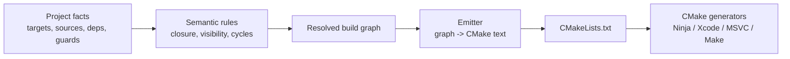
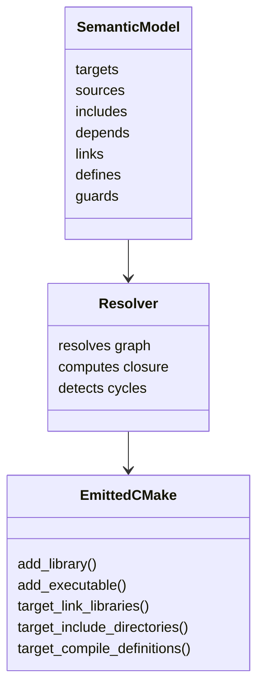

# Semantic Front End

CppLogicMake is a semantic front end for CMake, not a replacement for it.
The goal is to make the build description rational while leaving CMake to do
the part it already does well: generate Ninja, Xcode, MSVC, and Makefiles.

## What The Semantic Layer Owns

These are the parts that should be expressed declaratively and resolved before
emission:

| Concept | Responsibility |
|---|---|
| `target/2` | Target identity and kind |
| `sources/2` | Source selection via git pathspec resolution |
| `include/2` | Include path propagation |
| `depends/2` | Public dependency edges |
| `depends/3` | Private dependency edges |
| `link/2` | Link requirements and guards |
| `define/2` | Compile definitions and guards |
| `platform/1` | Platform-specific guards |
| `debug/0` | Configuration-specific guards |
| `cross_compiling/0` | Cross-compilation guards |
| `depends_all/2` | Transitive closure over the graph |
| `depends_public/2` | Public-only closure |
| `resolved_link/2` | Final link set after guards |
| `resolved_define/2` | Final define set after guards |
| `cyclic/1` | Cycle detection |
| `depends_on/2` | Reverse dependency query |

## What CMake Keeps

CppLogicMake should treat the following as backend concerns and pass them
through without semantic inflation:

| Concept | Responsibility |
|---|---|
| Generator choice | CMake decides whether to emit Ninja, Xcode, MSVC, or Makefiles |
| Toolchain integration | CMake handles compiler and platform wiring |
| Build execution | CMake performs the actual configure/generate/build steps |
| Imported targets | Existing CMake ecosystem remains available |
| Native platform features | Xcode/MSVC-specific project behavior stays in CMake |

## Non-Goals

- Reimplementing CMake's generator ecosystem
- Inventing a parallel package manager
- Hiding all generated CMake from the user
- Adding semantic features that cannot map cleanly to real CMake primitives

## Practical Rule

If a build concern changes the dependency graph, visibility, or source set, it
belongs in the semantic layer. If it changes how CMake emits or drives a native
build tool, it stays in the backend. The emitter should preserve CMake's own
`PUBLIC`/`PRIVATE`/`INTERFACE` scopes where the semantic model can express them,
instead of flattening everything into an opaque link list.
